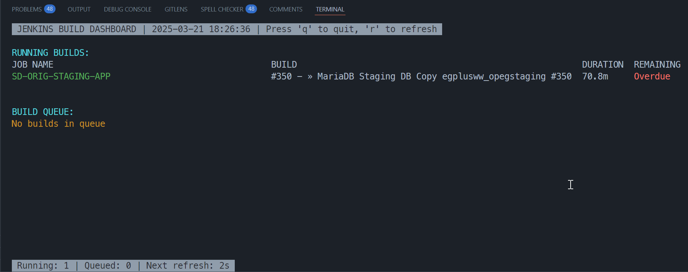

# Jenkins Build Dashboard

A lightweight web and CLI dashboard for monitoring Jenkins builds in real-time.

## Features

- **Real-time monitoring** of running builds with progress bars
- **Build queue** visibility with waiting times and reasons
- **Recent build history** showing the last 20 builds across all jobs
- **Auto-refresh** capability with configurable intervals
- **Branch information** display for pipeline jobs
- **Color-coded status indicators** for build results
- **Both CLI and Web interfaces** available

## Screenshots




## Requirements

- Python 3.7+
- Flask
- Requests
- Python-dotenv
- Windows users: windows-curses (for CLI dashboard)

## Quick Setup

### On Linux/macOS

1. Clone this repository:

   ```bash
   git clone [repository-url]
   cd jenkins-dashboard
   ```

2. Run the setup script:

   ```bash
   ./setup.sh
   ```

3. Activate the virtual environment:

   ```bash
   source venv/bin/activate
   ```

4. Edit the `.env` file with your Jenkins credentials

5. Run the dashboard:

   ```bash
   # For web dashboard
   python jenkins_dashboard_web.py

   # Or for CLI dashboard
   python jenkins_dashboard_cli.py
   ```

### On Windows

1. Clone this repository:

   ```cmd
   git clone [repository-url]
   cd jenkins-dashboard
   ```

2. Run the setup script:

   ```cmd
   setup.bat
   ```

3. Activate the virtual environment:

   ```cmd
   venv\Scripts\activate
   ```

4. Edit the `.env` file with your Jenkins credentials

5. Run the dashboard:
   ```cmd
   python jenkins_dashboard_web.py
   ```
   or
   ```cmd
   python jenkins_dashboard_cli.py
   ```

## Manual Installation

If you prefer to set up manually:

1. Clone this repository:

   ```bash
   git clone [repository-url]
   cd jenkins-dashboard
   ```

2. Create and activate a virtual environment:

   ```bash
   # On Linux/macOS
   python3 -m venv venv
   source venv/bin/activate

   # On Windows
   python -m venv venv
   venv\Scripts\activate
   ```

3. Install requirements:

   ```bash
   pip install -r requirements.txt

   # Windows users also need:
   pip install windows-curses  # Only for Windows
   ```

4. Create the `.env` file with your Jenkins credentials:
   ```
   JENKINS_URL=https://your-jenkins-server.com
   JENKINS_USERNAME=your_username
   JENKINS_API_TOKEN=your_api_token
   JENKINS_VERIFY_SSL=False
   ```

## Setting Up Your Environment File

The dashboard requires a `.env` file to securely store your Jenkins credentials. The setup scripts will create a template for you, but you need to edit it with your actual credentials:

1. Open the `.env` file in the project root directory
2. Update the following variables:
   ```
   JENKINS_URL=https://your-jenkins-server.com
   JENKINS_USERNAME=your_username
   JENKINS_API_TOKEN=your_api_token
   JENKINS_VERIFY_SSL=False
   ```

### Getting Your Jenkins API Token

1. Log in to your Jenkins server
2. Click on your username in the top right corner
3. Click on "Configure" or "Settings"
4. Look for the "API Token" section
5. Click "Add new Token" or "Create Token"
6. Give the token a descriptive name (e.g., "Dashboard Access")
7. Copy the generated token and paste it into your `.env` file

### Environment Variables Explained

- `JENKINS_URL`: The base URL of your Jenkins server (including http:// or https://)
- `JENKINS_USERNAME`: Your Jenkins username
- `JENKINS_API_TOKEN`: Your Jenkins API token (not your password)
- `JENKINS_VERIFY_SSL`: Set to "True" if you want to verify SSL certificates, "False" to ignore SSL verification

## Setup Script Details

The repository includes two setup scripts to make installation easier:

- `setup.sh` - For Linux and macOS
- `setup.bat` - For Windows

These scripts:

1. Create a Python virtual environment
2. Upgrade pip
3. Install required dependencies
4. Create necessary project directories
5. Generate template `.env` and `.gitignore` files

If you're on Windows, the script also installs `windows-curses` which is needed for the CLI dashboard.

## Installation with pip

You can also install the dashboard as a Python package:

```bash
pip install .
```

After installation, you can run:

```bash
# For CLI dashboard
jenkins-cli

# For web dashboard
jenkins-web
```

## Usage

### Web Dashboard

Run the web dashboard:

```bash
python jenkins_dashboard_web.py
```

Then open your browser to http://localhost:5000

The web dashboard features:

- Auto-refresh (configurable)
- Current running builds with progress indicators
- Build queue information
- Latest builds across all jobs

### CLI Dashboard

Run the CLI dashboard:

```bash
python jenkins_dashboard_cli.py
```

CLI controls:

- `q` - Quit the dashboard
- `r` - Manually refresh data

## Project Structure

- `jenkins_connector.py` - Core connection handling for Jenkins API
- `jenkins_dashboard_core.py` - Shared dashboard data logic
- `jenkins_dashboard_web.py` - Flask web application
- `jenkins_dashboard_cli.py` - Command-line interface
- `static/dashboard.js` - JavaScript for the web dashboard
- `templates/index.html` - HTML template for the web dashboard
- `setup.sh` - Setup script for Linux/macOS
- `setup.bat` - Setup script for Windows
- `setup.py` - Package installation configuration

## Configuration

### Environment Variables

| Variable             | Description                        | Default                     |
| -------------------- | ---------------------------------- | --------------------------- |
| `JENKINS_URL`        | URL of your Jenkins server         | https://jenkins.example.com |
| `JENKINS_USERNAME`   | Jenkins username                   | None                        |
| `JENKINS_API_TOKEN`  | Jenkins API token                  | None                        |
| `JENKINS_VERIFY_SSL` | Whether to verify SSL certificates | False                       |

### Refresh Interval

- Web dashboard: Configured in dashboard.js (REFRESH_INTERVAL constant)
- CLI dashboard: Configured in JenkinsDashboardCLI.**init** (self.refresh_interval)

## Error Handling

The dashboard is designed to be resilient to connectivity issues:

- Connection timeouts are handled gracefully
- Partial data will be displayed even if some API calls fail
- Clear error indicators show when there are connectivity problems
- Auto-refresh will continue trying to reconnect

## Troubleshooting

### Connection Issues

If you experience connection problems:

1. Verify your Jenkins URL is correct
2. Check that your API token is valid and not expired
3. Ensure your Jenkins user has appropriate permissions
4. Check network connectivity and firewall settings
5. Look at the logs in `jenkins_web_dashboard.log` for detailed error messages

### Missing Data

If some data is missing:

1. Check your Jenkins user permissions for the missing jobs
2. Increase timeouts in the connector if your Jenkins server is slow
3. Check if the specific Jenkins API endpoints are responding

## Contributing

Contributions are welcome! Please feel free to submit a Pull Request.

## License

[Your License Here]

## Acknowledgements

- This project uses [Bootstrap](https://getbootstrap.com/) for the web UI
- Icons provided by [Bootstrap Icons](https://icons.getbootstrap.com/)
